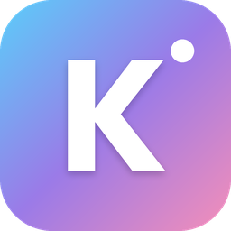
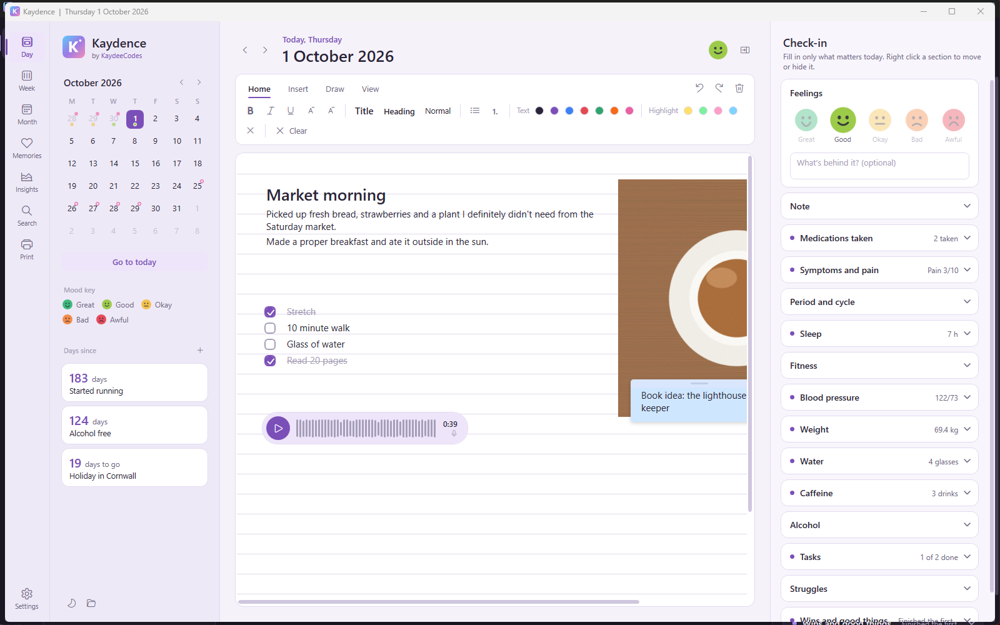

<p align="center">
  
</p>

<h1 align="center">Kaydence</h1>

<p align="center">
  <b>A private diary for Windows. No accounts, no cloud, no tracking.</b><br>
  Made by <a href="https://kaydee.codes">KaydeeCodes</a>
</p>

<p align="center">
  <a href="https://github.com/KaydeeCodes/Kaydence/releases/latest"><b>Download Kaydence</b></a> ·
  <a href="https://kaydence.kaydee.codes">Website</a> ·
  <a href="#privacy">Privacy</a> ·
  <a href="#reporting-a-problem">Report a problem</a>
</p>



## What is Kaydence?

Kaydence is a diary that lives on your PC. It opens straight onto today with the cursor ready, so you can start writing the moment it appears. Everything saves by itself, and nothing ever leaves your computer.

The page works a bit like OneNote: click anywhere to type, paste or drop in photos, draw, highlight, and add sticky notes, checklists and voice notes. Beside the page is a quick daily check-in for your mood and anything else you'd like to keep track of. A calendar shows at a glance which days you wrote about and how they felt.

It's a diary first. Health, period and transition tracking are optional extras you can switch on if you want them, and leave off completely if you don't.

### Highlights

- **Write anywhere on the page**, with bold, colours, headings, lists, sticky notes and checklists
- **Photos and drawings**: paste, drag in, crop, rotate, and draw over the top with pens, highlighters and shapes
- **Voice notes** of up to five minutes, played back right on the page
- **A daily check-in** for mood, sleep, tasks, wins and struggles, in whatever order you like
- **Look back** with Week, Month, Memories ("on this day") and Search
- **Insights**: mood over time, by weekday and season, and your year in pixels
- **Print or save as PDF**, including a tidy summary to take to a doctor
- **Optional password** that encrypts your whole diary with AES-256
- **Daily backups**, one click restore, and a full export to ordinary files
- **Light and dark mode**, accent colours, and dyslexia friendly fonts and spacing
- **A built in guide** for everything, opened with F1

## Screenshots

| | |
|---|---|
|  |  |
|  |  |

## Download and install

**System requirements:** Windows 10 or Windows 11, 64 bit. Everything Kaydence needs is included, there's nothing else to install. A microphone is only needed for voice notes.

1. Go to the [latest release](https://github.com/KaydeeCodes/Kaydence/releases/latest) and download `Kaydence-Setup-1.0.0.exe` (the number is the version).
2. Run it. Kaydence installs just for you, so it never asks for an administrator password.
3. Kaydence opens, and a short welcome tour helps you set it up.

> **"Windows protected your PC"?** Windows shows this for apps from small, independent developers that aren't yet widely downloaded. Click **More info**, then **Run anyway**. You can check the file is genuine by comparing its SHA256 checksum with the one listed on the release page.

**Updating:** Kaydence checks once a day for a new version and offers the download page. Run the new setup file and it updates in place, keeping everything.

**Uninstalling:** open Windows Settings, Apps, Installed apps, find Kaydence and choose Uninstall. Your diary, settings and backups are left exactly where they are, so nothing is lost if you install it again. To remove your diary too, delete the `%LocalAppData%\Kaydence` folder yourself afterwards.

## Where your diary is stored

Everything lives in one folder on your PC:

```
%LocalAppData%\Kaydence
```

That's usually `C:\Users\YourName\AppData\Local\Kaydence`. To open it, press **Win+R**, paste the line above and press Enter, or click the folder button in Kaydence's sidebar.

| Folder or file | What it holds |
|---|---|
| `Diary\` | Your diary: a folder for every day with its writing, check-in, photos, drawings and voice notes |
| `Backups\` | The daily backup zips (you can choose a different folder, like a USB stick) |
| `Logs\` | A record of what the app did, for bug reports. Never anything you wrote |
| `settings.json` | Your settings |

This folder isn't synced to OneDrive or any cloud service. The [data format](docs/DATA-FORMAT.md) is documented, so your diary is never locked in.

## Password, encryption and recovery

A password is optional. When you switch it on, Kaydence encrypts **every file in your diary** (pages, photos, voice notes and check-ins) with AES-256. Someone who copies your diary folder or takes your hard drive sees only scrambled data.

When you set a password, Kaydence asks you to save a **recovery file** (it ends in `.kaydencekey`). It's the spare key for your diary. If you forget your password, the recovery file lets you in and you choose a new one. You can also copy the recovery key into a password manager.

> **Please keep your recovery file safe.** There's no back door. If you lose both your password and your recovery file, nobody can open your diary, including the developer. Keep the recovery file somewhere other than your PC, like a USB stick or a password manager.

## Backups

Kaydence zips up your whole diary once a day, the first time you open it, and keeps the copies for 7 to 90 days (your choice). You can also back up at any time, pick a different backup folder such as a USB stick or a second drive, and restore a backup from Settings with one click. Kaydence always zips up your current diary first, so a restore can be undone.

Backups of an encrypted diary are encrypted too, and open with the password or recovery file you had when they were made.

## Take your diary with you

Your words are yours. **Settings, Your diary folder, Export to a folder** copies everything into ordinary files: one web page with every day, a text file per day, and your photos and voice notes as normal files. **Save as PDF** makes a single PDF of your whole diary. Exports are not encrypted, so keep them somewhere private.

## Privacy

- Your diary, photos, voice notes, settings and backups never leave your PC.
- There are no accounts, no sign in, no adverts, no analytics and no tracking of any kind.
- The only thing Kaydence sends over the internet is an optional daily check for a new version, which asks GitHub for the latest version number. Nothing about you or your diary is included, and you can switch it off in Settings.
- Photos are cleaned when you add them: hidden details like the place a photo was taken and the camera model are left behind.
- Logs and bug reports never contain anything you wrote, felt or recorded, and your Windows user name is hidden in any file path.

The full privacy statement is at [kaydence.kaydee.codes/privacy](https://kaydence.kaydee.codes/privacy).

## Health features are not medical advice

Kaydence is a diary, not a medical app. The medication, symptoms, blood pressure, weight, transition and period tools are for your own notes. Charts and summaries only show what you typed in. **Period and cycle predictions are rough guesses and must never be used as contraception.** Always speak to a doctor, nurse or pharmacist about your health.

## FAQ

**Does Kaydence work on a Mac, Linux, a phone or a tablet?**
Not at the moment. Kaydence is made for Windows 10 and 11.

**Can I use my diary on two PCs?**
Not at the same time yet. To move to a new PC, make a backup in Settings, copy the zip across, install Kaydence and use Restore. Your password or recovery file opens it on the new PC.

**I forgot my password.**
On the lock screen, click "Forgot your password? Use your recovery file" and choose the file, or paste the key from your password manager. Without either, an encrypted diary can't be opened.

**Is my diary really private if Kaydence is on GitHub?**
Your diary is never on GitHub. Only Kaydence's code is. Your diary only ever lives in `%LocalAppData%\Kaydence` on your own PC.

**How much space does my diary use?**
See Settings, Your diary folder, Space used.

**Does it cost anything?**
No. Kaydence is free for personal and non-commercial use.

## Reporting a problem

1. In Kaydence, open **Settings, Help and feedback** and click **Make a bug report**. This saves a zip with the last few days of logs and a list of your settings. Nothing you wrote is ever included, and you can look inside before sending it.
2. Click **Report a problem**, or [open a new issue](https://github.com/KaydeeCodes/Kaydence/issues/new/choose) here on GitHub.
3. Say what happened and attach the zip.

Ideas are very welcome too, use **Suggest a feature**. To report a security problem privately, see [SECURITY.md](SECURITY.md).

## Licence

Kaydence is free to use for personal and non-commercial purposes under the [PolyForm Strict License 1.0.0](LICENSE). In plain words:

- You can download, install and use Kaydence for free, for yourself, at home, or in a charity, school or other non-commercial organisation.
- You can't sell Kaydence, charge for it, or use it commercially.
- You can't share changed versions of Kaydence or redistribute it. Please send people to this page or the website instead, so they always get the genuine, latest version.

The code is public so you can see exactly what Kaydence does with your diary. This summary isn't legal advice, and the [LICENSE](LICENSE) file is what counts.

## Build it yourself

You'll need Windows, the [.NET 10 SDK](https://dotnet.microsoft.com/download) and an IDE such as JetBrains Rider or Visual Studio.

1. Open `Kaydence.sln`.
2. Build and run. There are no NuGet packages to restore.

To make the installer, install [Inno Setup 6](https://jrsoftware.org/isdl.php), then from the repository folder run:

```
powershell -ExecutionPolicy Bypass -File installer\build-installer.ps1
```

That publishes a single self contained `Kaydence.exe` into `publish\` and builds `installer\Output\Kaydence-Setup-<version>.exe`.

Building Kaydence exactly as it is, for your own use, is fine. The licence doesn't allow changing it or sharing your own builds. See [CONTRIBUTING.md](CONTRIBUTING.md).

### Project layout

```
Kaydence/
  Kaydence.sln
  src/Kaydence/
    App.xaml            start up, single copy, error catching
    MainWindow.xaml     the main window, shortcuts and autosave
    Assets/             logo and icon
    Guide/              the built in guide, one HTML file
    Controls/           calendar, page, check-in, charts, insights, print
    Models/             what a day, check-in and medication look like
    Services/           saving, encryption, settings, backups, export, logs
    Themes/             light and dark colours, shared styles
  installer/            Inno Setup script and the build script
  docs/                 changelog, roadmap and data format
```

See [docs/CHANGELOG.md](docs/CHANGELOG.md) for what's changed and [docs/ROADMAP.md](docs/ROADMAP.md) for what's coming.
